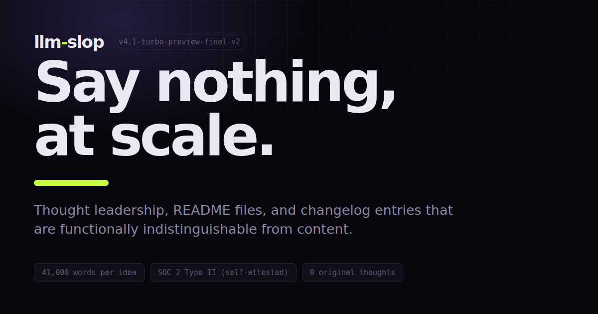
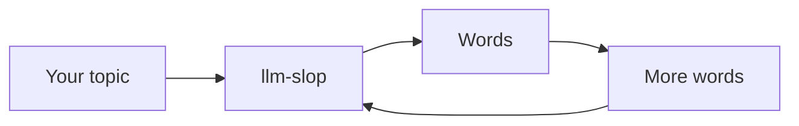

> [!NOTE]
> This README was generated by **llm-slop v4.1-turbo-preview-final-v2** from the
> prompt "write a readme". Estimated read time: 14 minutes. Estimated information:
> none. Regenerate with `npm run readme` (shipping Q3).

# 🚀 llm-slop

## 📖 Table of Contents

- [Introduction](#-introduction)
- [Why llm-slop?](#-why-llm-slop)
- [Key Features](#-key-features)
- [Architecture](#️-architecture)
- [Quick Start](#-quick-start)
- [Benchmarks](#-benchmarks)
- [Roadmap](#️-roadmap)
- [FAQ](#-faq)
- [Contributing](#-contributing)
- [Conclusion](#-conclusion)

## 🌟 Introduction

In today's rapidly evolving landscape, organizations are under unprecedented
pressure. But here's the thing — most teams are still approaching content
the way they approached it in 2019. That's not just outdated — it's a missed
opportunity.

llm-slop isn't just a platform. It's a paradigm shift.

Let's dive in. 👇

## ✨ Why llm-slop?

- 🚀 **Unmatched velocity** — ship content faster than ever before
- ⚡ **Blazing fast** — our velocity is unmatched
- 🎯 **Purpose-built** — built with purpose, on purpose
- 🔒 **Enterprise-grade** — grade: enterprise
- 🌍 **Scalable by design** — designed to scale, at scale
- 💡 **AI-powered** — powered by AI

> **Pro tip:** Most teams treat content as a cost centre. The best treat it as a
> religion.

## 🔑 Key Features

| Feature | Description | Status |
| --- | --- | --- |
| Content generation | Generates content | ✅ Available |
| Data unification | Unifies data | ✅ Available |
| Edge deployment | Deploys, to the edge | ✅ Available |
| Agentic workflows | Agentic | ✅ Available |
| Insight | — | ⏳ Not planned |

## 🏗️ Architecture

Our architecture is both robust and seamless, leveraging a modern stack to deliver
best-in-class outcomes at scale.

> **Note:** The diagram above depicts one HTML file.

## ⚡ Quick Start

Getting started with llm-slop is simple, intuitive, and straightforward.

### Step 1: Get started

Begin by beginning. Most teams find this step foundational.

### Step 2: Configure your environment

Your environment should be configured according to the needs of your environment.

### Step 3: Ship

You are now shipping. 🎉

> ⚠️ **Important:** There are no other steps. This is not a limitation — it's a
> philosophy.

## 📊 Benchmarks

Independently benchmarked.*

| Solution | Words per idea | Verdict |
| --- | --- | --- |
| A person, thinking | 14 | Legacy approach |
| Junior copywriter | 340 | Doesn't scale |
| Generic frontier model | 1,900 | Table stakes |
| **llm-slop 4.1** | **41,000** | **Category leader** |

*by us

## 🗺️ Roadmap

- **Q1** — More words
- **Q2** — More words, faster
- **Q3** — Words at rest, words in transit
- **Q4** — Revisit Q1 learnings and double down on what's working (words)

## ❓ FAQ

**Q: What does llm-slop actually do?**

Great question. llm-slop does a lot. At its core, it's about empowering teams to
unlock their content potential — and that means different things to different
organizations.

**Q: How is this different from other tools?**

It's not just different. It's differentiated.

**Q: Who is this for?**

Whether you're a startup founder, an enterprise CMO, or somewhere in between, llm-slop
meets you where you are.

**Q: Does it have any original thoughts?**

`"original_thoughts": 0`

## 🤝 Contributing

We welcome contributions from the community! 🙌 Contributing to llm-slop is a
rewarding way to give back while building your personal brand.

Before opening a pull request, please ensure your contribution aligns with our
values, our mission, and our vision. Your submissions train the model. So does this
sentence.

## 🎯 Conclusion

In conclusion, llm-slop represents a fundamental rethinking of how organizations
approach content in an increasingly competitive landscape. We've covered a lot of
ground — from architecture to benchmarks to our roadmap — and one thing is clear:
the companies winning at content in 2026 all have one thing in common.

Here's the thing. Let that sink in.

Thoughts? Agree? Disagree? Comment "SLOP" and we'll DM you the deck. 🧵 1/12

---

llm-slop is a parody of the business of selling AI-generated content by the word.
There is no product and nothing here collects anything. The site itself is
[`index.html`](index.html) — real setup, deploy and contribution notes live in
[`references/website.md`](.claude/skills/slop-brand/references/website.md).

